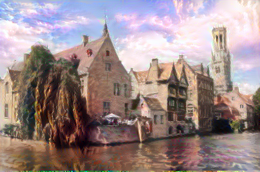

# Style_Transfer

In this repository are scripts to build and run two types of neural style transfer models. 

The first uses an optimization technique for two images, a content image and a style reference image, to blend them together to make a new images that make the content image look like it was painted in the style of the style reference image. This is implemented by optimizing an output image to match the content statistics if the content image and the style statistics of the style reference image which are extracted from the images using the intermediatary layers of Convolution Neural Network. The vgg19 model, used in this example, is trained to understand an input image and generalize its invariances and defining features within classes, ignoring potential background noise. Between feeding the input image and receiving the classification label, the model serves as a complex feature extractor that we can strip apart to understand the content and style features of an image. So, with a model that can extract the contetn and feature of an image, we extract the content features from the content image, the style features from the style reference image, and adjust an output image with gradent descent that minimizes a loss function that tries to minimize the loss for the content features and style features. The use of the nueral style transfer model was motivated by [this article](https://www.tensorflow.org/tutorials/generative/style_transfer).

 

  
   
  

The second is a Fast Style Transfer algorithm that trains

